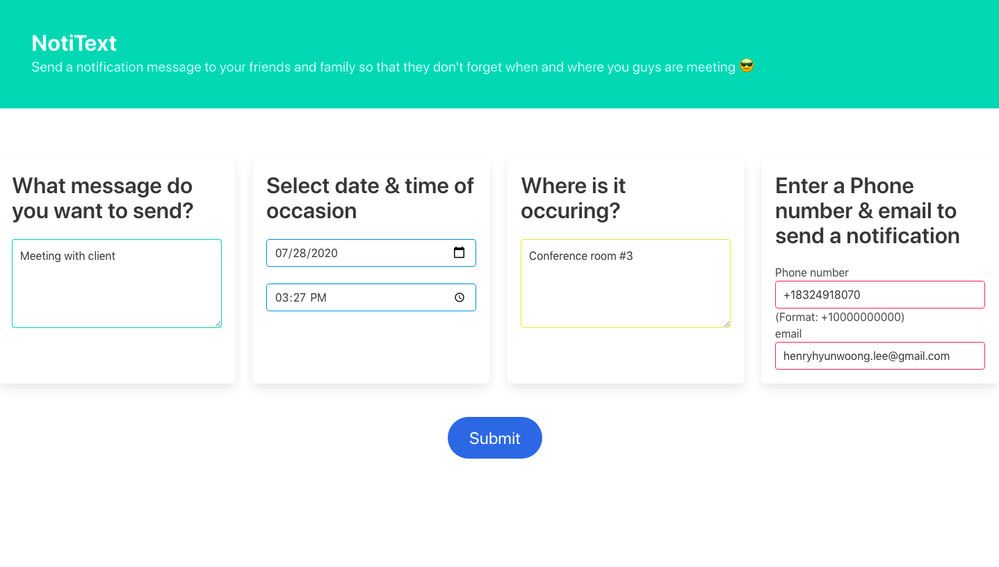
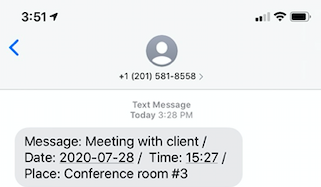
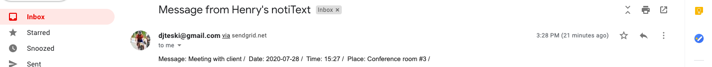
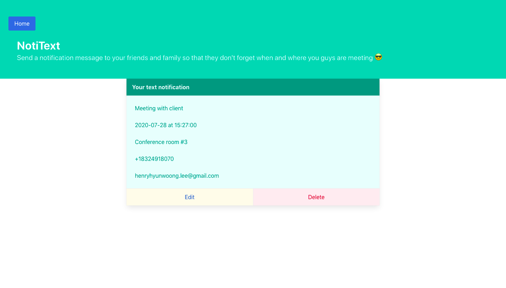
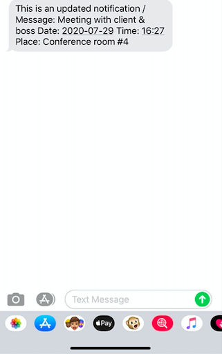
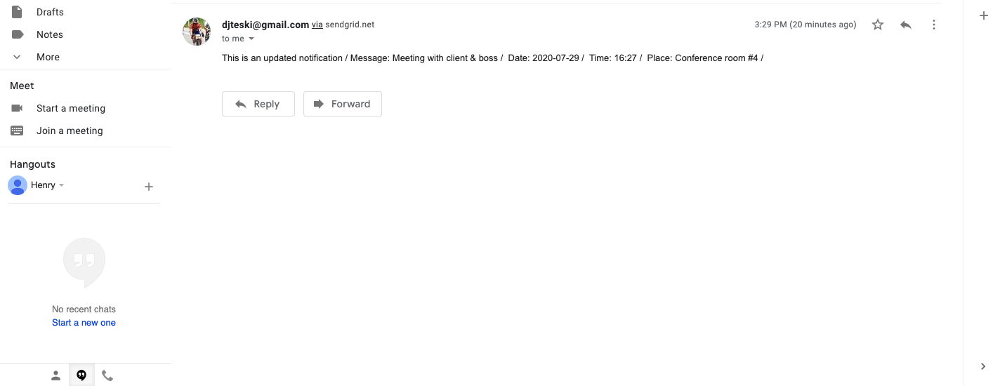

# notiText

## About
notiText is a web application that you can send a SMS and an email as a reminder of you and someone else's commitment.


### Home Page
You can type your message, select date & time, type the place of where your commitment is occuring, and as a last your phone number and email address.




### Sending Messages
Once you click Submit button, the message will be sent to the reicipient via SMS and email.


#### SMS                         
            


#### Email



### Your notifications page
All of your notifications are stored in Postgresql DB and are fetched in this page. You can also _edit_and_delete_the notification



### Edit Page
You can edit the contents of your notification and send it a recipient again. 


### Updated Notification
Updated notification will be sent via SMS and email stating:

> This is an updated notification

#### SMS


#### Email



Frontend Technologies
```
ReactJS
Bulma
```

Backend Technologies
```
nodeJS
expressJS
KnexJS
Postgresql
```
